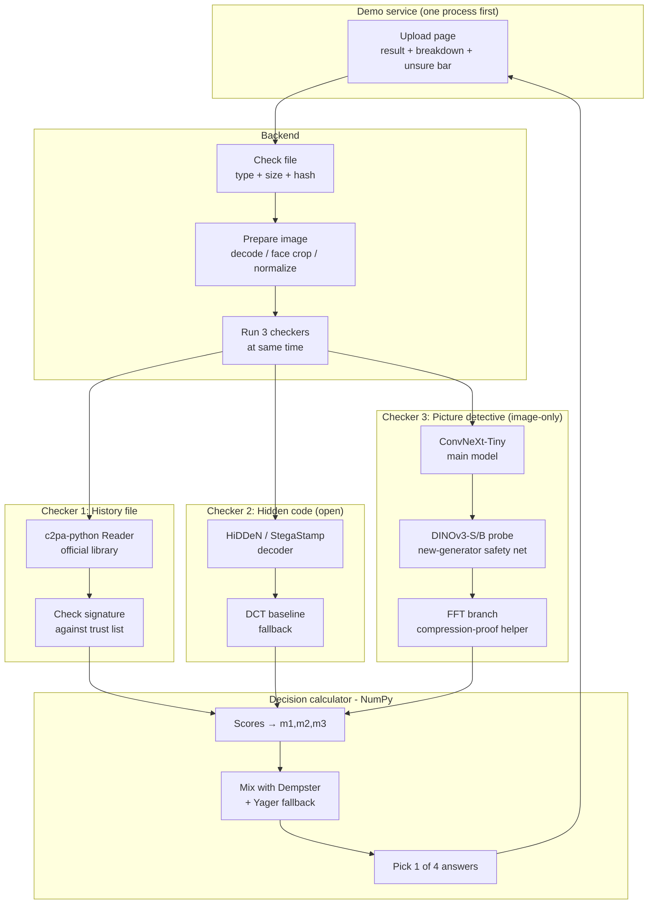

# Toward Robust AI Media Authentication
### Hybrid Framework: C2PA Provenance + Invisible Watermarking + Deep Learning Forensics, fused with Dempster-Shafer Theory

> Status: **Pre-implementation (docs only). Image-only MVP, open weights only.**
> Scope lock: images first (`jpg/png/webp`). No video yet. No closed/API models.

**Problem:** Generative AI (diffusion, GAN) produces images indistinguishable to humans. Single-method detectors fail: models improve fast, adversaries strip metadata / purify watermarks, and any single bypass = total failure.

**Solution:** Defense-in-depth with 3 independent pillars + DST fusion that models uncertainty instead of forcing a binary guess:
1. **Provenance (C2PA)** — cryptographic origin when available.
2. **Watermarking** — resilient soft-binding in pixels when headers are stripped.
3. **Forensics** — intrinsic artifact analysis when both above are attacked.

If one layer is defeated, the others still function. If evidence conflicts, DST resolves it mathematically.

---

## 1. Requirements

### 1.1 Functional Requirements

| ID | Requirement | Details / Acceptance |
|----|-------------|----------------------|
| FR-1 | Media ingestion (image-only) | Accept image (`jpg/png/webp`) via upload. Validate magic bytes + size cap, decode with OpenCV/Pillow, face-crop + resize/normalize. Video/audio/text deferred to v2. |
| FR-2 | Provenance extraction (C2PA) | Use official `c2pa-python` (`Reader`) + `c2patool` for spot checks — do NOT hand-parse JUMBF/CBOR/COSE. Check `validation_state` + codes (`claimSignature.validated`, `assertion.dataHash.mismatch`, `signingCredential.trusted`) against trust anchors. Output mass `m1`. Missing manifest ≠ authentic → `m_uncert=1.0`. |
| FR-3 | Watermark detection (open only) | Pluggable detector interface. MVP: open weights only — `HiDDeN` / `StegaStamp` decoder + simple DCT-DWT baseline. Park Gaussian Shading / InvisMark / SynthID behind interface (blocked: need attacker UNet / closed weights / text-API). Absent watermark → `m_auth=0.05, m_uncert=0.95`. |
| FR-4 | Forensic analysis (image-only) | ConvNeXt-Tiny (`timm`, ImageNet) fine-tuned head + frozen DINOv3-S/B + linear probe (fallback DINOv2-B) + cheap FFT-magnitude branch + MTCNN face crop. Temperature-scaled confidence → mass `m3`. Must work with zero metadata. No video models in v1 (no R3D/BiLSTM/Transformer). |
| FR-5 | DST fusion engine | Pure-NumPy Dempster combine, sequential `m1 ⊕ m2 ⊕ m3`, conflict `K`, source discounting, **Yager fallback: if `K>0.6` put conflict into ignorance → `Unknown`**. Deterministic, unit-tested on canonical vector in §2.3. |
| FR-6 | Classification | Map fused mass to 1 of 4 statuses: `Verified AI Origin`, `Provenance Available`, `Suspicious`, `Unknown` (see §4.4). Return driving-signal provenance (which pillar decided). |
| FR-7 | API + UI (single service first) | One demo service to start (Gradio or FastAPI+Streamlit, not both). Returns JSON `{status, masses, belief, plausibility, conflict_K, per_pillar}` + upload page with result card + uncertainty bar. |
| FR-8 | Logging & reproducibility | JSONL logs (no Pandas): file hash, per-pillar outputs, masses, fused result, model versions + weight hashes, latency. Fixtures in `tests/fixtures/`. Pin `Python 3.11`, weights from HuggingFace Hub, fp16. |

### 1.2 Non-Functional Requirements

| ID | Requirement | Target |
|----|-------------|--------|
| NFR-1 | Robustness | Survive: metadata stripping, JPEG/WebP recompression, resize/crop, noise/blur. Degrade gracefully under purification (forensics must still fire, else `Unknown`). |
| NFR-2 | Uncertainty honesty | Never force binary when evidence is weak. `Unknown` is a valid, preferred output over a wrong guess. Uncertainty = `m({A,S})`. |
| NFR-3 | Extensibility | New detector = new mass function, no fusion change. All pillars share `MassFunction` interface. |
| NFR-4 | Performance | Image end-to-end < 10s on RTX 3050 6GB fp16 (CPU fallback slower). Fusion itself < 10ms. No video perf target in v1. |
| NFR-5 | Reproducibility | `Python 3.11` pinned (torch wheels lag newest Python), pinned `requirements.txt`, seeded inference, model weight hashes logged. |
| NFR-6 | Compliance | C2PA layer aligns to EU AI Act Art. 50 (effective 2026-08-02): machine-readable AI-origin marking, effective/interoperable/robust/reliable. Log retention for audit. |
| NFR-7 | Security | Validate uploads (magic bytes, size caps), no arbitrary code exec, trust-list pinning for C2PA certs, secret keys for watermark detectors never shipped to frontend. |

### 1.3 Out of Scope (v1)

- Video / audio / LLM-text pipelines (v2).
- Closed weights or API-only models (SynthID API, non-public InvisMark weights).
- Training detectors from scratch (v1: pretrained + linear probe / head-only only).
- Real-time edge / mobile SDK. Remote C2PA Manifest Store production integration (stubbed).

---

## 2. System Design

### 2.1 High-Level Architecture



**Key design choice:** checkers run in parallel with timeouts. Any checker may say `unsure` without blocking the others. Video path deleted for v1.

### 2.2 Core Data Contract

All pillars speak one language:

```python
@dataclass
class MassFunction:
    m_auth: float   # m({Authentic})
    m_synth: float  # m({Synthetic})
    m_uncert: float # m({Authentic, Synthetic})
    # invariant: sum == 1.0 ± 1e-6, each in [0,1]
```

Mapping rules (from docs):

| Pillar output | Mass |
|---------------|------|
| Valid AI manifest | `m_synth=0.95, m_uncert=0.05` |
| Valid camera manifest, no AI assertion | `m_auth=0.95, m_uncert=0.05` |
| No manifest | `m_uncert=1.0` |
| Watermark verified | `m_synth=0.90, m_uncert=0.10` |
| No watermark | `m_auth=0.05, m_uncert=0.95` |
| Forensics e.g. 80% synth, 10% margin | `m_synth=0.80, m_auth=0.10, m_uncert=0.10` |

### 2.3 DST Fusion (canonical Step-0 vector — do not change without updating tests)

Frame of discernment `Ω = {Authentic, Synthetic}`, power set `{∅, {A}, {S}, {A,S}}`.

Dempster's rule for `m1 ⊕ m2`:

```
m12(H) = (1 / (1 - K)) * Σ m1(A)*m2(B),  A∩B = H
K = Σ m1(A)*m2(B),  A∩B = ∅   (conflict)
```

Sequential: `m123 = (m1 ⊕ m2) ⊕ m3`. Report `Belief(S) = m({S})`, `Plausibility(S) = m({S}) + m({A,S})`.

**High-conflict guard (Yager fallback):** if `K > 0.6`, do NOT normalize away conflict — move `K` into ignorance (`m_uncert`) and output `Unknown`. Classic Dempster alone gives Zadeh-paradox / dictatorial-zero results under high conflict.

**Canonical evasion example (frozen regression test):**
Inputs: stripped manifest (`m1: A=0.0, S=0.0, U=1.0`) + erased watermark (`m2: A=0.05, S=0.0, U=0.95`) + strong forensics (`m3: A=0.10, S=0.80, U=0.10`).
`m1⊕m2 = m2` (empty opinion changes nothing).

| `m12` | `m3` | Intersection | Product | Goes to |
|---|---|---|---|---|
| A 0.05 | S 0.80 | ∅ | 0.040 | K |
| A 0.05 | A 0.10 | {A} | 0.005 | Authentic |
| A 0.05 | U 0.10 | {A} | 0.005 | Authentic |
| U 0.95 | S 0.80 | {S} | 0.760 | Synthetic |
| U 0.95 | A 0.10 | {A} | 0.095 | Authentic |
| U 0.95 | U 0.10 | {U} | 0.095 | Uncertainty |

Unnormalized: `A=0.105, S=0.760, U=0.095, K=0.040` (sums to 1.0).
Normalized `÷0.96`: **`m_auth=0.109375, m_synth=0.791667, m_uncert=0.098958`**, `Bel(S)=0.7917, Pl(S)=0.8906, K=0.04` → `Suspicious` (forensics-driven).

> Note: `docs.md` omitted two Authentic terms (got `m_auth=0.005`, wrong). PDF `82.8%` is irreproducible from stated inputs — discarded. `docs2.md` matches this canonical result.

### 2.4 Output Classification

| Status | Condition | Meaning |
|--------|-----------|---------|
| **Verified AI Origin** | `m_synth > 0.7` AND driver ∈ {provenance, watermark} | Crypto/watermark proof of AI |
| **Provenance Available** | `m_auth > 0.7` AND driver = provenance | Crypto proof of camera/human |
| **Suspicious** | `m_synth > 0.5` driven by forensics, OR weak provenance + forensic signal | Stripped but artifacts found |
| **Unknown** | `m_uncert > 0.5` OR contradiction (`K` high) OR no pillar confident | Honest abstain |

### 2.5 Proposed Repo Layout (to be created in Phase 0 — image-only)

```
.
├── README.md
├── requirements.txt
├── app/
│   ├── api/            # single demo service (Gradio or FastAPI)
│   ├── pillars/
│   │   ├── provenance/ # c2pa-python wrapper
│   │   ├── watermark/  # HiDDeN/StegaStamp + DCT baseline
│   │   └── forensics/  # convnext + dino probe + fft branch
│   ├── fusion/         # mass.py, dempster.py (+Yager), classify.py
│   └── frontend/       # only if split from api later
├── tests/
│   ├── test_fusion.py  # canonical vector regression (Step 0)
│   ├── test_pillars.py
│   └── fixtures/       # 5-10 open-license images
└── eval/               # strip / recompress / crop attack sims
```

### 2.6 Tech Stack (v1 slim)

| Layer | Choice | Why |
|-------|--------|-----|
| Lang | Python 3.11 pinned | Torch wheels lag newest Python |
| DL | PyTorch + timm + transformers | ConvNeXt-T, DINOv3-S/B (fallback DINOv2-B), all open on HF |
| Media | OpenCV, Pillow | Decode, face crop, resize/normalize |
| Math | NumPy, SciPy | DST ops |
| Logs | JSONL (stdlib) | No Pandas needed |
| C2PA | c2pa-python + c2patool | Official, don't hand-roll crypto |
| Demo | Gradio (or FastAPI+Uvicorn) | One process first |
| VCS | Git + GitHub | Version + weight-hash tracking |

Hardware: Intel i5/Ryzen 5+, 16GB RAM, NVIDIA 6GB VRAM (local RTX 3050 qualifies). Weights from HF Hub on startup, fp16.

---

## 3. Phased Implementation Plan — in simple terms

> Build order: **calculator first, fake versions second, real AI last.** Every phase ends with something you can run and see.

### Phase 0 — Create the empty project folders
- **In plain words:** Right now we only have docs. This step creates the actual project: folders for code, a list of needed libraries, and a few test images.
- **What we do:** Make folders (`app/`, `tests/`), make the library list, add 5-10 sample images (real + AI-made).
- **What you get:** You can run a test command and it says "all good". No AI yet.

### Phase 1 — The decision calculator (no AI yet) ⭐ start here
- **In plain words:** This is the brain that combines 3 opinions into 1 answer. Example: Layer 1 says "I don't know", Layer 2 says "maybe real", Layer 3 says "looks fake" → calculator says "79% fake".
- **What we do:** Write simple math code that takes 3 scores, mixes them, and picks 1 of 4 answers: AI-made / Real with proof / Suspicious / Don't know. Also shows how unsure it is.
- **What you get:** You can type in 3 fake scores and get the final answer. This proves the math works before we add heavy AI.

### Phase 2 — Checker 1: History file (C2PA)
- **In plain words:** Some images carry a hidden history file that says "made by camera X" or "made by AI". This checker reads that file and checks if it was tampered with. If the file is missing (Instagram often deletes it), it honestly says "I don't know" instead of guessing "real".
- **What we do:** Use the official `c2pa-python` library (don't write crypto ourselves). Check signature + trust list + pixel-hash check.
- **What you get:** Real photo with history → "Real with proof". AI file with history → "AI-made". Normal upload with no history → "Don't know, ask other checkers".

### Phase 3 — Checker 2: Hidden watermark (open version)
- **In plain words:** A watermark is a secret code hidden inside the pixels (you can't see it). Even if the history file is deleted, this code survives. We use openly available readers so we never get blocked.
- **What we do:** Plug-in slot with HiDDeN / StegaStamp decoder + simple backup method. Gaussian/InvisMark/SynthID parked for later (need closed weights or attacker model).
- **What you get:** If code found → "points to AI". If not found → "mostly unsure".

### Phase 4 — Checker 3: AI detective (image-only)
- **In plain words:** This needs no history file and no hidden code. It just looks at the picture for weirdness: strange skin, weird eyes, unnatural textures. Last safety net when attackers delete everything else. No video in v1.
- **What we do:** ConvNeXt-Tiny main model + DINOv3-S/B smart helper (fallback DINOv2-B) + frequency helper for compressed images. Calibrate so blurry input → more unsure, not a lie.
- **What you get:** A score like "79% looks AI-made, 10% unsure".

### Phase 5 — Connect everything (backend server)
- **In plain words:** Run all 3 checkers at the same time and return one clean answer as text (JSON) that other apps can use.
- **What we do:** Make an upload link. When you send a picture, it runs all 3 checkers in parallel, mixes results with the Phase 1 calculator, saves a log.
- **What you get:** You send a picture → you get back: final answer + 3 individual scores + how unsure + how long it took. Even if one checker crashes, you still get an answer.

### Phase 6 — Simple website (upload button)
- **In plain words:** A basic page where you drag a picture, press check, and see the result with simple bars.
- **What we do:** Upload box, big result card, 3 small boxes showing what each checker said, an "unsure" bar.
- **What you get:** Anyone (even non-technical) can test it in 30 seconds.

### Phase 7 — Try to break it (testing)
- **In plain words:** Pretend to be the attacker: delete history, compress the image, crop it, add noise, try to wash away the watermark. Check if the system still catches the fake.
- **What we do:** Scripts that damage test images in those ways, then measure: does combined system beat each checker alone?
- **What you get:** A short report: "after attacks, single checker = 65%, combined = 79%". Proof it is actually more robust.

### Phase 8 — Make it safe and legal-ready
- **In plain words:** Stop bad uploads, lock versions of models, measure speed/memory, write down how this meets EU AI Act rules.
- **What we do:** File-type checks, size limits, speed test on your RTX 3050, notes on making it smaller/faster for low-end devices later.
- **What you get:** A demo you can show without fear it crashes or guesses wildly.

**Suggested build order:** Phase 0 → 1 → 2 → 3 → 5 → 6 (you get a full fake demo fast) → 4 (add real AI) → 7 → 8.

---

## 4. Quickstart (once Phase 0 lands — image-only)

```bash
python3.11 -m venv .venv && source .venv/bin/activate
pip install -r requirements.txt
pytest -q                       # canonical DST vector + pillar stubs
python -m app.api               # single demo service (Gradio or FastAPI)
# c2patool image.jpg            # optional CLI spot-check for C2PA
```

---

## 5. Sources

- `docs.md` — technical spec (mermaid-heavy). Note: its DST table drops two Authentic terms — README §2.3 is canonical.
- `docs2.md` — pedagogical expansion + glossary. Its DST numbers match the canonical vector.
- `Deepfake Research Paper Expansion-1.pdf` — full paper. Note: its `82.8%` fused claim is irreproducible — discarded.
- `first draft-1.pdf` — early draft.
- Open libs: `c2pa-python` / `c2patool`, `timm` (ConvNeXt), HuggingFace (DINOv3/DINOv2), HiDDeN/StegaStamp repos.
- Regulatory driver: EU AI Act Art. 50 (machine-readable AI marking from 2026-08-02, fines up to €15M / 3% turnover).

## 6. Limitations (v1 acknowledges)

Image-only, open-weights only. Trust-list dependency, generalization gap on novel generators, purification can still force `Unknown` (by design — honest abstain over wrong guess). Video, audio, edge deployment deferred to v2.
